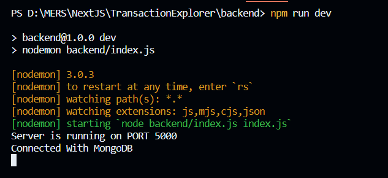

# Transaction Explorer 

## Backend
## Tech Stack

1. **Node.js / Express.js:** .

2. **MongoDB:** 

## Libraries Used

1. **mongoose:** Used to establish a connection with MongoDB, providing a simple and efficient way to interact with the database.

2. **axios:** Used to make HTTP requests, facilitating communication with external APIs if needed.

3. **dotenv:** Used to load and use environmental variables, ensuring secure configuration of sensitive data.

4. **cors:** Implemented to enable Cross-Origin Resource Sharing (CORS) permissions, allowing controlled access to the backend from different origins.

5. **nodemon:** Integrated for automatic code monitoring during the development process, enabling real-time updates.

## Getting Started

Follow the steps below to set up and run the backend:

1. *Clone the Repository:* - git clone https://github.com/manu-hn/TransactionExplorer.git
2. *Navigate to the project directory:* - cd backend or open the directory in VS code
3. *Install dependencies:* - run the `npm install` command to install all the dependencies required for the project
4. *Configure ENV Variables::* - `PORT`=your_desired_port_number, `MONGO_URL`=your_mongo_connection_url
5. *Start the server:* -run the command `npm run dev` The server will start on the specified port, and you should see a confirmation message in the terminal as shown in below image.

## API Endpoints

1. **GET - /api/transactions/initialize-database:** Initializes the database with data from the provided URL.

2. **GET - /api/transactions/search-query:** Searches transactions based on query parameters.

3. **GET - /api/transactions/statistics:** Retrieves a statistical report, including the total sale amount, total items sold, and unsold items for a selected month.

4. **GET - /api/transactions/bar-chart:** Fetches data for a bar chart, illustrating the number of items in different price ranges.

5. **GET - /api/transactions/pie-chart:** Fetches data for a pie chart, presenting unique categories and the respective number of items in each category.

6. **GET - /api/transactions/three-apis:** Gathers data from multiple APIs, consolidating the responses into a final JSON.

## License

For educational purposes only. Use, modify, and distribute at your own risk.

## Frontend
## Tech Stack

1. **React.js** .

2. **Tailwind CSS**.
 
3. **Parcel Bundler** 